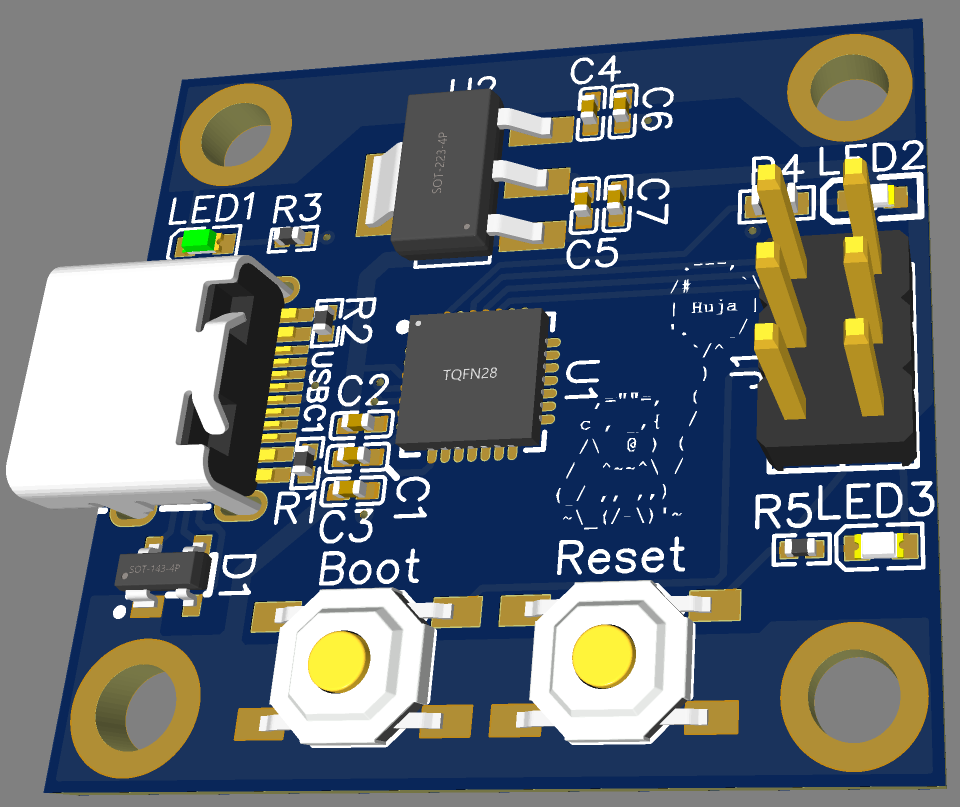

# UsbSerialProgrammer
A programmer with DTR and RTS outputs to allow programming without additional circuitry. It also supplies 3.3 V to the connected device. Hardware schematic and PCB can be found [here](https://oshwlab.com/Absolute-Maximum-Ratings/usbserialprogrammer).

Pinout (pin 1 on front left side):

| Pin | Function    |
|-----|-------------|
| 1   | 3.3 V       |
| 2   | GND         |
| 3   | Reset (RTS) |
| 4   | Boot (DTR)  |
| 5   | TX          |
| 6   | RX          |
